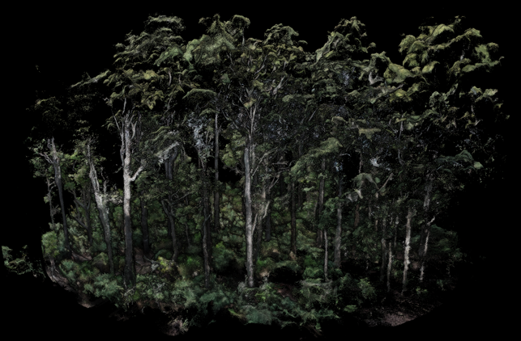
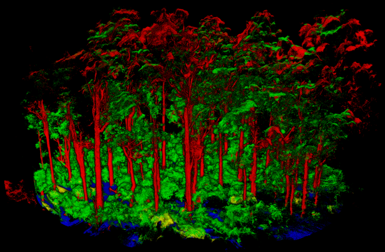
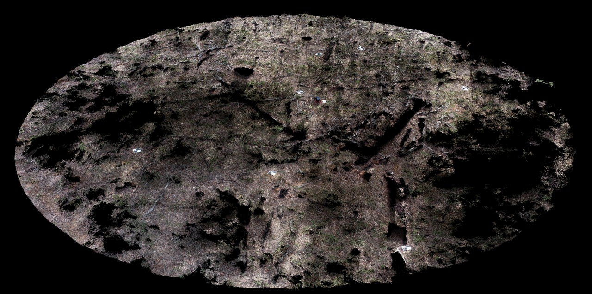
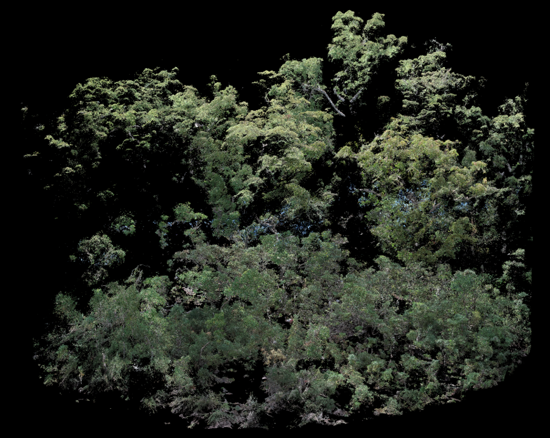
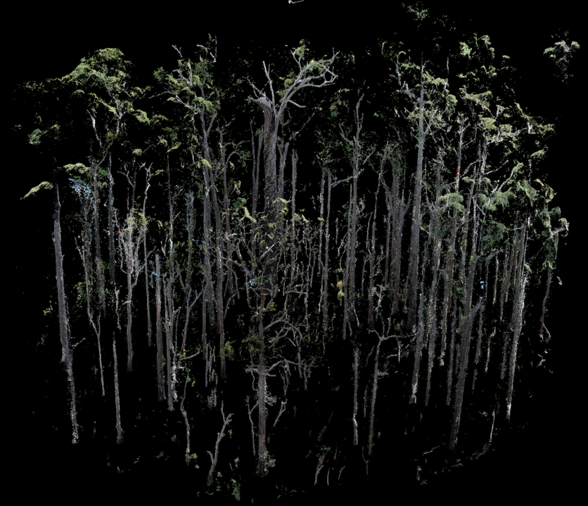

# Forest Structural Complexity Tool

### Created by Sean Krisanski

## Purpose of this tool

This tool was written for the purpose of allowing plot scale measurements to be extracted automatically from most
high-resolution forest point clouds from a variety of sensor sources. Such sensor types it works on include
Terrestrial Laser Scanning (TLS), Mobile Laser Scanning (MLS), Terrestrial Photogrammetry, Above and below-canopy
UAS Photogrammetry or similar. Very high resolution Aerial Laser Scanning (ALS) is typically on the borderline of what
the segmentation tool is capable of handling at this time. If a dataset is too low resolution, the segmentation model
will likely label the stems as vegetation points instead.

There are also some instances where the segmentation model has not seen appropriate training data for the point cloud.
This will be improved in future versions, as it should be easily fixed with additional training data.

This usage of this tool is intended to be accessable to as many people as possible. With that goal in mind, I hope to 
one day turn this into a simple executable program to avoid the need for Python skills. If you know how to do this and 
would like to help make it happen, please get in touch!

## Installation

You will need to install all packages in the requirements.txt file. 

If using Anaconda, create a clean environment and activate it. In Anaconda Prompt, type
"pip install -r requirements.txt" and it should hopefully install all required packages for you.

## How to use

Open the "run.py" file and set num_procs and batch_size appropriately for your computer hardware.
Adjust the parameters if needed or leave them as they are.

Run the "run.py" file. This will ask you to select 1 or multiple ".las" files.
If all goes well, you will have a new directory in the same location as the ".las" file/s you selected and once complete,
this will contain the following outputs.

Start with small plots containing at least some trees. The tree measurement code will currently cause an error if it
finds no trees in the point cloud.

## FSCT Outputs

**Plot_Report.html and Plot_Report.md**
A summary of the information extracted. Nicer to look at than the processing report, but still a bit ugly in Version 1.
Future versions will make this a bit nicer/add data tables/etc.

**tree_data.csv**
Basic measurements of the trees. 
Headings are as follows (all units are in metres or cubic metres for volume)
[x_tree_base, y_tree_base, z_tree_base, DBH, Height, Volume, Crown_mean_x, Crown_mean_y, Crown_top_x, Crown_top_y, Crown_top_z, mean_understory_height_in_5m_radius]

**processing_report.csv**
Summary information about the plot and the processing times. 

**plot_centre_coords.csv**
The XY coordinates of the plot centre. *Will delete soon and just use processing_report for data storage.* 

**plot_extents.csv**
XY coordinates of a rectangle defined by the edges of the plot and the plot centre. *Note: may delete or replace this soon*

### Point Cloud Outputs

**DTM.las** Digital Terrain Model in point form.

**cropped_DTM.las** Digital Terrain Model cropped to the plot_radius.
###

**<PLOT_NAME>_working_point_cloud.las** The subsampled and cropped point cloud that is fed to the segmentation tool.

**segmented.las** The classified point cloud created by the segmentation tool.

**segmented_cleaned.las** The cleaned segmented point cloud created during the post-processing step.

**terrain_points.las**  Segmented terrain points.

**vegetation_points.las** Segmented vegetation points.

**ground_veg.las** Ground vegetation points.

**veg_points_sorted.las** Vegetation assigned by tree_id. Ground points are given a tree_id of 0.

**cwd_points.las** Segmented Coarse woody debris points.

**stem_points.las** Segmented stem points.

**stem_points_sorted.las** Stem points assigned by tree_id.

**cleaned_cyls.las** Point-based cylinder representation with a variety of properties. 

**cleaned_cyl_vis.las** A point cloud visualisation of the circles/cylinders defined in cleaned_cyls.las
Essentially makes circles out of points for every measurement in cleaned_cyls.

**text_point_cloud.las** A point cloud text visualisation of DBH, height, CCI at breast height. 
It's a bit dodgy, but it works in any point cloud viewer.

**tree_aware_cropped_point_cloud.las** If you specify a plot_radius and a plot_radius_buffer, this will trim the point
cloud to the plot_radius. See the **Tree Aware Plot Cropping** section in User Parameters for more information on this mode.

### Recommended PC Specifications
**Warning: FSCT is computationally expensive in its current form.** Fortunately, it is still considerably faster than a human 
at what it does.

It is strongly recommended to have a CUDA compatible GPU (Nvidia) for running this tool. This can be run on CPU
only, but expect inference to take a long time.

It should be able to be run on most modern gaming desktop PCs (or decently powerful laptops).

I use the following setup and the computational times are tolerable:
- CPU: Intel i9-10900K (overclocked to 4.99GHz all cores).
- GPU: Nvidia Titan RTX (24 GB vRAM)
- RAM: 128 GB DDR4 at 3200 MHz (NOTE: this is often not enough on large point clouds, so I have a 500 GB page file to assist if I run out of RAM).
- SSD: M.2 NVMe 2 TB, 3500 MB/s read,  3000 MB/s write.

Hopefully in time, I'll be able to make this more efficient and less resource hungry.

## User Parameters

### Circular Plot options
#### plot_centre
[X, Y] Coordinates of the plot centre (metres). If "None", plot_centre is the median XY coords of the point cloud. Leave at None if not using.

#### plot_radius
If 0 m, the plot is not cropped. Otherwise, the plot is cylindrically cropped from the plot centre with plot_radius + plot_radius_buffer. Leave at 0 if not using.

#### plot_radius_buffer
This is used for "Tree Aware Plot Cropping Mode". Leave at 0 if not using.

### Rectangular/Tiled Plot options (NOT YET IMPLEMENTED)
This will be a tile-based version of "Tree Aware Plot Cropping Mode" once implemented.
#### x_length=0,
#### y_length=0,
#### edge_buffer=0,

### Tree Aware Plot Cropping
The purpose of this mode is to simulate the behaviour of a typical field plot, by not chopping trees in half if they are
at the boundary of the plot radius.

We first trim the point cloud to a radius where the initial trim radius = plot_radius + plot_radius_buffer.
For example, we might want a 20 m plot_radius. If we use a 3 m plot_radius_buffer, the point cloud will be cropped to
23 m radius initially. FSCT will then use the measurement information extracted from the trees in that 23 m radius point
cloud, to check which tree centres are within the 20 m radius. This allows a tree which was just inside the boundary, to
extend 3 m beyond the plot boundary without losing points. If we used a simple radius trim at 20 m, trees which were
just inside the boundary may be cut in half.

This mode is used if plot_radius is non-zero and plot_radius_buffer is non-zero.
### Other Parameters
#### Site
Enter the site name if you wish. Only used for report generation.

#### PlotID
Enter the plot name/ID if you wish. Only used for report generation.

#### UTM_zone_number
Optional: Set this or the Lat Lon outputs will be incorrect.

#### UTM_zone_letter
Optional: Used for the plot report.

#### UTM_is_north
If in the northern hemisphere, set this to True, otherwise False.

### Set these appropriately for your hardware.
#### batch_size
The number of samples in a batch used for the deep learning inference. This number depends on the amount of GPU memory you
have. If you set this too high, you will run out of GPU memory. As a rough guide, I can fit 18-20 on an Nvidia Titan RTX GPU with 24 GB GPU
RAM.

#### num_procs
The number of CPU cores you have/wish to use.

### Optional settings - Generally leave as they are.

#### ground_veg_cutoff_height
Any vegetation points below this height are considered to be understory and are not assigned to individual trees.

#### veg_sorting_range
Vegetation points can be, at most, this far away from a cylinder horizontally to be matched to a particular tree.

#### sort_stems
If you don't need the sorted stem points, turning this off speeds things up. Veg sorting is required for tree height measurement, but stem sorting isn't necessary for general use.

#### stem_sorting_range
Stem points can be, at most, this far away from a cylinder in 3D to be matched to a particular tree.

#### low_resolution_point_cloud_hack_mode
This model was trained on relatively high resolution point clouds, so if a stem is of sufficiently low resolution,
it will likely be classified as vegetation instead. Eventually, I will train this model on a larger training dataset
with more examples of sparse point clouds, however, in the meantime, I came up with an ugly hack that
sometimes helps a little when working with low resolution datasets (which this tool was not really designed for).

Low resolution hack mode will copy the input point cloud, jitter the points in random directions by 1 cm, then join this
copied point cloud to the original point cloud. This gives the model more points to work with, which is closer to what
it was trained on. Once inference is complete, the original point cloud is returned.

#### delete_working_directory
Generally leave this on. Deletes the files used for segmentation after segmentation is finished.
You may wish to turn it off if you want to re-run/modify the segmentation code so you don't need to run pre-processing every time.

## Scripts

**run.py** This is how you should interface with the code base.

**run_tools.py** A few helper functions to clean up run.py.

**tools.py** Other helper functions used throughout the code base.

**preprocessing.py** Performs subsampling of the input point cloud and handles the slicing and dicing of the point
cloud into samples the segmentation model can work with.

**model.py** The segmentation model modified from the Pytorch Geometric implementation of Pointnet++.

**inference.py** Performs the semantic segmentation on the samples and then reassembles them back into a full point
cloud.

**post_segmentation_script** Creates the Digital Terrain Model (DTM) and uses this and some basic rules to clean the
segmented point cloud up. Creates the class specific point clouds (terrain, vegetation, CWD and stem points).

**measure.py** Extracts measurements and metrics from the outputs of the post_segmentation_script.

**report_writer** Summarises the measurements in a simple report format.

## Citation
### If you use this tool in published research, please cite:

**The semantic segmentation tool is described here:**
\
Krisanski, S.; Taskhiri, M.S.; Gonzalez Aracil, S.; Herries, D.; Turner, P. Sensor Agnostic Semantic Segmentation of
Structurally Diverse and Complex Forest Point Clouds Using Deep Learning. Remote Sens. 2021, 13, 1413.
https://doi.org/10.3390/rs13081413

\
**The measurement tool is described here:**
\
Krisanski, S.; Taskhiri, M.S.; Gonzalez Aracil, S.; Herries, D.; Montgomery, J.; Turner, P. Forest Structural Complexity Tool - An Open
Source, Fully-Automated Tool for Measuring Forest Point Clouds. Remote Sens. 2021, XX, XXXX. 
https://doi.org/XX.XXXX/rsXXXXXXXX

## Acknowledgements
This research was funded by the Australian Research Council - Training Centre for Forest Value 
(University of Tasmania, Australia).

Thanks to my supervisory team Assoc. Prof Paul Turner and Dr. Mohammad Sadegh Taskhiri from the eLogistics Research
Group and Dr. James Montgomery from the University of Tasmania.

Thanks to Susana Gonzalez Aracil and David Herries from Interpine Group Ltd. (New Zealand), who provided a number of the raw point
clouds and plot measurements used during the development and validation of this tool.

## Contributing
Interested in contributing to this code? Get in touch! This code is likely far from optimal, so if you find errors or 
have ideas/suggestions on improvements, they would be very welcome!

## References
The deep learning component uses Pytorch https://pytorch.org/ and Pytorch-Geometric 
https://pytorch-geometric.readthedocs.io/en/latest/#

The first step is semantic segmentation of the forest point cloud. This is performed using a modified version of
Pointnet++ https://github.com/charlesq34/pointnet2 using the implementation in Pytorch-Geometric as a starting point
provided here: https://github.com/rusty1s/pytorch_geometric/blob/master/examples/pointnet2_segmentation.py

We make extensive use of NumPy (Harris, C.R., Millman, K.J., van der Walt, S.J. et al. Array programming with NumPy.
Nature 585, 357–362 (2020). https://doi.org/10.1038/s41586-020-2649-2) and Scikit Learn (Scikit-learn: Machine Learning in Python, Pedregosa et al., JMLR 12, pp. 2825-2830, 2011. http://jmlr.csail.mit.edu/papers/v12/pedregosa11a.html)
