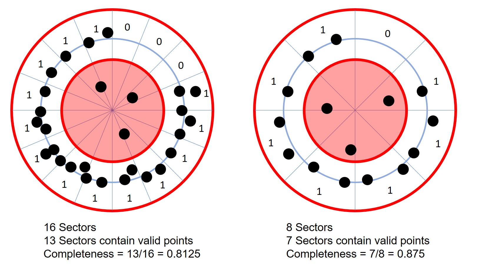
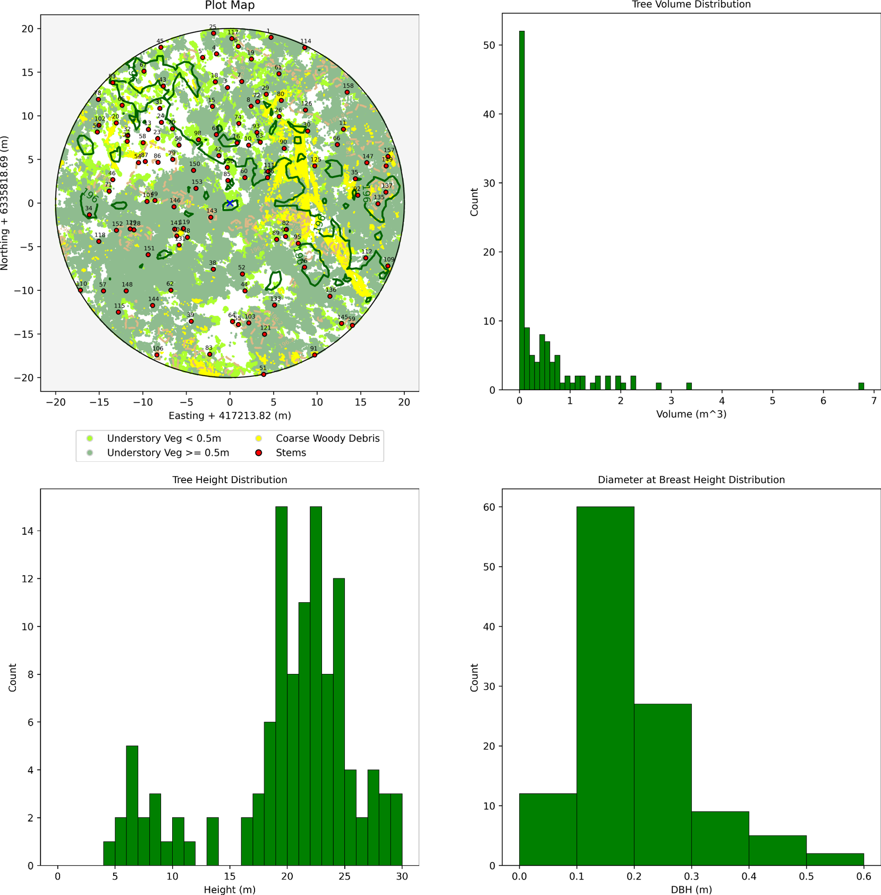
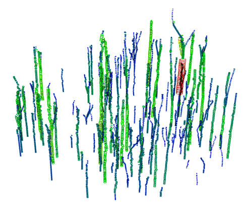
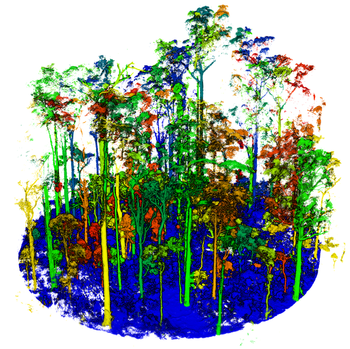
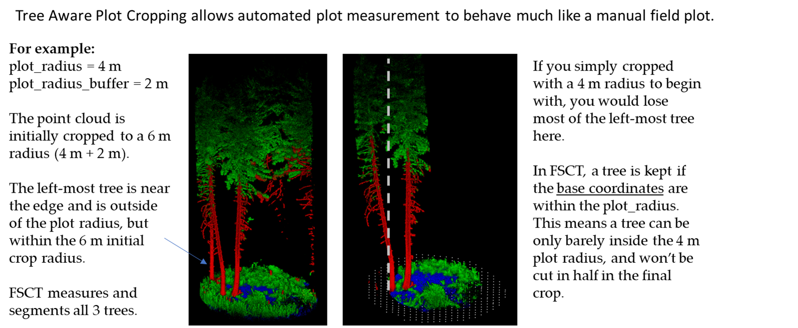

# Forest Structural Complexity Tool

### Created by Sean Krisanski

## Purpose of this tool

This tool was written for the purpose of allowing plot scale measurements to be extracted automatically from most
high-resolution forest point clouds from a variety of sensor sources. Such sensor types it works on include
Terrestrial Laser Scanning (TLS), Mobile Laser Scanning (MLS), Terrestrial Photogrammetry, Above and below-canopy
UAS Photogrammetry or similar. Very high resolution Aerial Laser Scanning (ALS) is typically on the borderline of what
the segmentation tool is capable of handling at this time. If a dataset is too low resolution, the segmentation model
will likely label the stems as vegetation points instead.

There are also some instances where the segmentation model has not seen appropriate training data for the point cloud.
This may be improved in future versions, as it should be easily fixed with additional training data.

**A video showing the outputs of the tool is provided here: https://youtu.be/rej5Bu57AqM**


## Installation

You will need to install all packages in the requirements.txt file. 

If using Anaconda, create a clean environment and activate it. 
In Anaconda Prompt, type the following (replacing the path to FSCT and your desired environment name as needed):

```shell
cd PATH_TO_FSCT-MAIN_DIRECTORY
conda create --name YOUR_ENVIRONMENT_NAME_HERE
conda activate YOUR_ENVIRONMENT_NAME_HERE
conda install pip
pip install -r requirements.txt
```

This should hopefully install all required packages for you.
These are the instructions for Windows 10 and Linux.
I have not tested this on Mac. If someone with a Mac tests this and 
it works (or doesn't), please let me know!

If you have any difficulties or find any bugs, please get in touch and I will try to help you get it going. 
Suggestions for improvements are greatly appreciated.

If you do not have an Nvidia GPU, please set the ```use_CPU_only``` setting in ```run.py``` to True.

## How to use

Open the "run.py" file and set num_procs and batch_size appropriately for your computer hardware.
Adjust the parameters if needed or leave them as they are.

Run the "run.py" file. This will ask you to select 1 or multiple ".las" files.
If all goes well, you will have a new directory in the same location as the ".las" file/s you selected and once complete,
this will contain the following outputs.

Start with small plots containing at least some trees. The tree measurement code will currently cause an error if it
finds no trees in the point cloud.

## FSCT Outputs

**Plot_Report.html and Plot_Report.md**
A summary of the information extracted. Nicer to look at than the processing report, but still a bit ugly in Version 1.
Future versions may make this a bit nicer/add data tables/etc.

**tree_data.csv**
Basic measurements of the trees.
* Headings are as follows (all units are in metres or cubic metres for volume)
[x_tree_base, y_tree_base, z_tree_base, DBH, CCI_at_BH, Height, Volume_1, Volume_2, Crown_mean_x, Crown_mean_y, Crown_top_x, Crown_top_y, Crown_top_z, mean_understory_height_in_5m_radius]
* CCI_at_BH stands for Circumferential Completeness Index at Breast Height. CCI is simply the fraction of a circle with
point coverage in a stem slice as illustrated below. This provides an indication of how complete your stem coverage is.
In a single scan TLS point cloud, you cannot get a CCI greater than 0.5 (assuming the cylinder fitting was not erroneous), as only one side of the tree is mapped.
If you have completely scanned the tree (at the measurement location), you should get a CCI of 1.0 (the highest possible CCI).

The figure is from this paper: https://doi.org/10.3390/rs12101652 if you would like a more detailed explanation of the idea.


* Volume_1 is the sum of the volume of the fitted cylinders. 
* Volume_2 is the volume of a cone (with a base diameter equal to the DBH and height from 1.3 m up to the tree height) + 
the volume of a cylinder (with a diameter of DBH and 1.3 m tall). This avoids the possibility of a short and shallow 
angled cone resulting from a short tree with a large DBH.* 

**processing_report.csv**
Summary information about the plot and the processing times. Be aware: if you open this while processing and FSCT
attempts to write to the open file, it will throw a permission error.





### Point Cloud Outputs

**DTM.las** Digital Terrain Model in point form.


**cropped_DTM.las** Digital Terrain Model cropped to the plot_radius.

**working_point_cloud.las** The subsampled and cropped point cloud that is fed to the segmentation tool.


**segmented.las** The classified point cloud created by the segmentation tool.


**segmented_cleaned.las** The cleaned segmented point cloud created during the post-processing step.

**terrain_points.las**  Semantically segmented terrain points.

**vegetation_points.las** Semantically segmented vegetation points.

**ground_veg.las** Ground vegetation points.

**cwd_points.las** Semantically segmented Coarse woody debris points.

**stem_points.las** Semantically segmented stem points.

**cleaned_cyls.las** Point-based cylinder representation with a variety of properties. 

**cleaned_cyl_vis.las** A point cloud visualisation of the circles/cylinders defined in cleaned_cyls.las
Essentially makes circles out of points for every measurement in cleaned_cyls.



**stem_points_sorted.las** Stem points assigned by tree_id. **This is a simple output at the moment and will not give
highly reliable results.** This current iteration may be useful for generating instance segmentation training datasets,
however, this will likely require you to manually correct it to be of high enough quality for training data.

**veg_points_sorted.las** Vegetation assigned by tree_id. Ground points are given a tree_id of 0. **This is a simple 
output at the moment and will not give highly reliable results.** This current iteration may be useful for generating 
instance segmentation training datasets, however, this will likely require you to manually correct it to be of high 
enough quality for training data.


**text_point_cloud.las** A point cloud text visualisation of TreeId, DBH, height, CCI at breast height, Volume_1 and 
Volume_2. It's a bit dodgy, but it works in any point cloud viewer without fuss.

**tree_aware_cropped_point_cloud.las** If you specify a plot_radius and a plot_radius_buffer, this will trim the point
cloud to the plot_radius. See the **Tree Aware Plot Cropping** section in User Parameters for more information on this mode.




### Recommended PC Specifications
**Warning: FSCT is computationally expensive in its current form.** Fortunately, it is still considerably faster than a human 
at what it does.

It is strongly recommended to have a CUDA compatible GPU (Nvidia) for running this tool. This can be run on CPU
only, but expect inference to take a long time.

It should be able to be run on most modern gaming desktop PCs (or decently powerful laptops).

I use the following setup and the computational times are tolerable:
- CPU: Intel i9-10900K (overclocked to 4.99GHz all cores).
- GPU: Nvidia Titan RTX (24 GB vRAM)
- RAM: 128 GB DDR4 at 3200 MHz (If you run out of RAM, try increasing your page file size (Windows) or swap size (Linux))

Hopefully in time, I'll be able to make this more efficient and less resource hungry.

## User Parameters

### Circular Plot options
#### plot_centre
[X, Y] Coordinates of the plot centre (metres). If "None", plot_centre is the centre of the bounding box of the point cloud. Leave at None if not using.

#### plot_radius
If 0 m, the plot is not cropped. Otherwise, the plot is cylindrically cropped from the plot centre with plot_radius + plot_radius_buffer. Leave at 0 if not using.

#### plot_radius_buffer
This is used for "Tree Aware Plot Cropping Mode". Leave at 0 if not using.

### Tree Aware Plot Cropping
The purpose of this mode is to simulate the behaviour of a typical field plot, by not chopping trees in half if they are
at the boundary of the plot radius.

We first trim the point cloud to a radius where the initial trim radius = plot_radius + plot_radius_buffer.
For example, we might want a 4 m plot_radius. If we use a 2 m plot_radius_buffer, the point cloud will be cropped to
6 m radius initially. FSCT will then use the measurement information extracted from the trees in that 6 m radius point
cloud, to check which tree centres are within the 4 m radius. This allows a tree which was just inside the boundary, to
extend 2 m beyond the plot boundary without losing points. If we used a simple radius trim at 4 m, trees which were
just inside the boundary may be cut in half.



This mode is used if plot_radius is non-zero and plot_radius_buffer is non-zero.
### Other Parameters

#### PlotId
The "PlotId" is taken from the filename of the input point cloud, so name files accordingly.

### Set these appropriately for your hardware.
#### batch_size
The number of samples in a batch used for the deep learning inference. This number depends on the amount of GPU memory you
have. If you set this too high, you will run out of GPU memory. As a rough guide, I can fit 18-20 on an Nvidia Titan RTX GPU with 24 GB GPU
RAM.

#### num_procs
The number of CPU cores you have/wish to use.

### Optional settings - Generally leave as they are.

#### ground_veg_cutoff_height
Any vegetation points below this height are considered to be understory and are not assigned to individual trees.

#### veg_sorting_range
Vegetation points can be, at most, this far away from a cylinder horizontally to be matched to a particular tree.

#### sort_stems
If you don't need the sorted stem points, turning this off speeds things up. Veg sorting is required for tree height measurement, but stem sorting isn't necessary for general use.

#### stem_sorting_range
Stem points can be, at most, this far away from a cylinder in 3D to be matched to a particular tree.

#### taper_measurement_height_min
The starting height for the output taper measurements.

#### taper_measurement_height_max
Taper measurements are extracted up to this height above the DTM.

#### taper_measurement_height_increment
The increment of the taper measurements.

#### taper_slice_thickness
The cleaned cylinders (in the point based representation) within +/- 0.5 * taper_slice_thickness are found. The largest radius within this slice is used as the diameter for that particular height. 

#### delete_working_directory
Generally leave this on. Deletes the files used for segmentation after segmentation is finished.
You may wish to turn it off if you want to re-run/modify the segmentation code so you don't need to run pre-processing every time.

## Scripts

### Scripts you would normally interact with:
**run.py** This is how you should interface with the code base under normal use.

**combine_multiple_output_CSVs.py** This will get
all "plot_summary.csv" files and combine them into one CSV. This will be saved in the highest common directory
of the selected point clouds.

### Scripts you would only use directly if you are modifying the software:
**run_tools.py** A few helper functions to clean up run.py.

**tools.py** Other helper functions used throughout the code base.

**preprocessing.py** Performs subsampling of the input point cloud and handles the slicing and dicing of the point
cloud into samples the segmentation model can work with.

**model.py** The segmentation model modified from the Pytorch Geometric implementation of Pointnet++.

**inference.py** Performs the semantic segmentation on the samples and then reassembles them back into a full point
cloud.

**post_segmentation_script.py** Creates the Digital Terrain Model (DTM) and uses this and some basic rules to clean the
segmented point cloud up. Creates the class specific point clouds (terrain, vegetation, CWD and stem points).

**measure.py** Extracts measurements and metrics from the outputs of the post_segmentation_script.

**report_writer.py** Summarises the measurements in a simple report format.


## Known Limitations
* Young trees with a lot of branching do not currently get segmented correctly.
* Some extremely large trees do not currently get measured properly as the rules don't always hold.
* FSCT is unlikely to output useful results on low resolution point clouds. 
* *Very high* resolution Aerial LiDAR is about the lowest it can currently cope with. If your dataset is on the borderline,
try setting low_resolution_point_cloud_hack_mode (in other_parameters.py) to 4 or 5 and rerunning. It's an ugly hack, but it can help sometimes.
* Segmentation does often miss some branches, but usually gets the bulk of them.
* Small branches are often not detected.
* Completely horizontal branches/sections may not be measured correctly from the method used.

## Citation
#### If you wish to cite this work, please use the below citation. If citing for something other than a scientific journal, feel free to link to the GitHub instead.
Krisanski, S.; Taskhiri, M.S.; Gonzalez Aracil, S.; Herries, D.; Muneri, A.; Gurung, M.B.; Montgomery, J.; Turner, P. Forest Structural Complexity Tool—An Open Source, Fully-Automated Tool for Measuring Forest Point Clouds. Remote Sens. 2021, 13, 4677. https://doi.org/10.3390/rs13224677

## Use of this code
Please feel free to use/modify/share this code. If you can improve/evaluate the code somehow and wish to make a paper of it, please do!
I might not have a chance to make many improvements going forward after my PhD, but I will try to keep it maintained.

If you can share your improvements, that would be great, but you are not obligated. Commercial use of FSCT is also permitted.

## Contributing/Collaborating
This code is likely far from optimal, so if you find errors or have ideas/suggestions on improvements/better practices,
they would be most welcome!

## Acknowledgements
This research was funded by the Australian Research Council - Training Centre for Forest Value (IC150100004),
University of Tasmania, Australia.

Thanks to my supervisory team Assoc. Prof Paul Turner and Dr. Mohammad Sadegh Taskhiri from the eLogistics Research
Group and Dr. James Montgomery from the University of Tasmania.

Thanks to Susana Gonzalez Aracil, David Herries from Interpine Group Ltd (New Zealand) https://interpine.nz/, Allie 
Muneri and Mohan Gurung from PF Olsen (Australia) Ltd. https://au.pfolsen.com/, who provided a number of the raw point
clouds and plot measurements used during the development and validation of this tool.


## References
The deep learning component uses Pytorch https://pytorch.org/ and Pytorch-Geometric 
https://pytorch-geometric.readthedocs.io/en/latest/#

The first step is semantic segmentation of the forest point cloud. This is performed using a modified version of
Pointnet++ https://github.com/charlesq34/pointnet2 using the implementation in Pytorch-Geometric as a starting point
provided here: https://github.com/rusty1s/pytorch_geometric/blob/master/examples/pointnet2_segmentation.py
